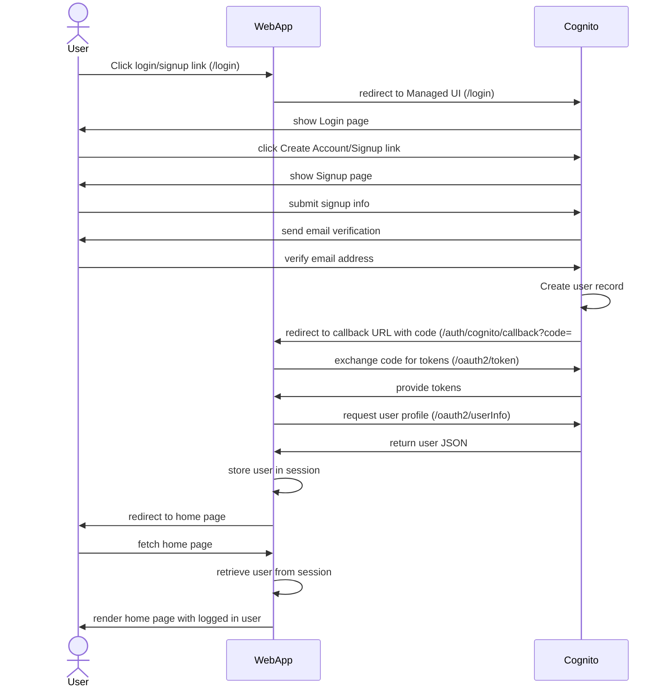

# Echo-Cognito-Auth Example App

This is a simple example app that demonstrates use of [AWS Cognito](https://docs.aws.amazon.com/cognito/) for user accounts and authentication within a Go app using the [Echo framework](https://echo.labstack.com/) (and [Templ](https://templ.guide/) templates).

It also is designed as a "lambdalith" (i.e. single lambda to server all/majority of the app) and uses the Serverless Framework to deploy (you can ignore this if you prefer to deploy via another mechanism). The exception to that is that there are two separate lambdas for the Cognito triggers that are used. These triggers 1) notify you when an account is created (allowing you to then add that to your own DB or whatever you might need); and 2) provide a way to customize the email verification messages that Cognito sends.

There are many, many ways to do user accounts and authentication within web apps, and this is not saying this is the best. This is just a sample to show how you could do it with these particular technologies, and was a way for me to have a baseline example of using Cognito in an Echo app, along with a few other bits.

I've also added a few other bits (e.g. use of Go's `slog` for logging), as this is somewhat serving as a general example for projects using these technologies.

Also, feedback is very welcome! I'm new to a few of these technologies, so if there are more idiomatic or better ways to do things, I'd love to hear it (you can file an issue, or comment on the blog post).

## Features/Goals

Some specific features, or goals of this demo:

* Use Echo framework, and a fully server-side, Go language web app.
* As part of using Echo, and creating a "lambdalith", use the [AWS Lambda Web Adapter](https://github.com/awslabs/aws-lambda-web-adapter/tree/main), which is a layer you can add to lambda to have it handle/route/support a standard web app (this works with many languages/frameworks). It basically allows you to just create a normal web app and you don't need to write an actual Lambda handler (the layer basically does that). In this case, you'd build a regular Go web app binary, ensure you run it on the proper port (8080 is the default, but you can change that), and voila, it just works.
* Use Cognito for user accounts and auth. I've used Cognito in other projects, but not in the same way (via Amplify library in mobile apps, and via Amplify in a JavaScript app, as well as use of Cognito lambda authorizers (both IAM and the User Pool style) in serverless apps, etc.).
* Use of Cognito's "Hosted UI" (this is fairly minor, as this is also relatively easy to swap out, and there's an example of doing it all yourself in the [AWS Cognito Workshop](https://www.cognitobuilders.training/30-lab2/20-add-user-sign-up/)). And technically, it's using the "Managed Login" which is their new version, whereas the "Hosted UI" is the "classic"/older version. Managed has a few more requirements and needs as you'll see below.
* Understand the precise flow and URLs, etc. Cognito uses in this situation.
* Try out [Goth](https://github.com/markbates/goth/tree/master) as a more standardized way to do OAuth/OpenID Connect flows in a Go app. I also explored a few other things, but my particular project that was driving this fit with Goth the most (I will be using multiple auth systems).
    * I wound up not using this in the end, because it seems it's not ideal (or even usable?) for use with the Managed Login/Hosted UI setup, where all you need it for is the token exchange. It complained that a session didn't exist when trying to directly use it for token exchange (without having gone through an initial "authorize" call). Token exchange is simple to implement yourself anyway (I'd done it for Strava and a few others before, and this is almost identical, as would be nearly any OAuth2 based system). So, in the end, one less dependency and directly managed code with nothing extra.
* I had really not seen any existing example out there, so hope this may be useful to others.
* Beyond just doing an auth, showing how you then persist that user info in a session for subsequent requests, logout, etc.
* Not really a goal, but a requirement: serving the app's static assets (CSS, images, etc.) using the Go `embed` mechanism, since we are deploying a single binary (see notes below).

## Sequence Diagram



Note, Login (vs. Signup) is essentialy the same, but obviously the user just enters their email & password instead of new user details. The rest of the flow is identical (same callback, etc.).

## Additional Notes

* The organization of this project is not "professional" in the sense that it's very small and everything is mostly in one directory and a few files, vs. better organization for a larger project, etc. The aim is not to show you how to organize a project, but to show how Cognito would be used in this type of app.
* Static assets are embedded in the app and served using a mounted filesystem when deployed, but are served from the local file system when running locally. The embedding approach is needed with Lambda, because you get a single binary to deploy, so you don't have a place to deploy the assets files. You could of course take other approaches, e.g. deploy those assets to S3, etc. With a lot of assets, or just for caching and so on, a real production robust system would likely use a different approach. You could also remove the local file system serving and use embedding always. There are other ways to do this as well, for example using [go.rice](https://github.com/GeertJohan/go.rice). See the [Echo cookbook Embed Resources](https://echo.labstack.com/docs/cookbook/embed-resources).
* Templ use in Echo is covered in [their docs](https://templ.guide/integrations/web-frameworks/) as well.
* This is using the Go "tool" [installation for Templ](https://templ.guide/quick-start/installation).
* If you are using Cursor or VS Code, you will want to add the following to your settings to get proper Templ formatting:
```
  "editor.formatOnSave": true,
  "[templ]": {
    "editor.defaultFormatter": "a-h.templ"
  },
  "emmet.includeLanguages": {
    "templ": "html"
  },
  "tailwindCSS.includeLanguages": {
    "templ": "html"
  }
```
* Upon user login, in your callback route handler, you will get the "user info" from Cognito. This includes their ID and their name. This sample app extracts those and stores them in the session. This gives you the user's name, without then having to also store their name (and theoretically keep it in sync) in your own user DB record.
* Additionally, we use the Cognito user ID (a UUID like value) as our own user ID, which means that you don't need to do an extra lookup of your own app's User record by Cognito ID - juse use the Cognito ID for your User ID in general. This way you have it in your session and know it immediately upon a login, without having to do a lookup of your own user record, etc.
* When using Cognito triggers AND user pool custom attributes AND Serverless Framework, there is a [bug](https://github.com/serverless/serverless/issues/9635#issuecomment-950349653) where your triggers will get removed on deploy, if you add/remove custom attributes. There is a workaround (adding the `forceDeploy` flag), but I've found that when you do that, there is a delay, and it takes several seconds or more for the fixing up of those triggers. This means that if someone were to sign up during this period, the triggers may not fire and this could ruin your event flow/necessary functionality. As is shown in this example, if you are relying on the Post Confirmation trigger to create a user record in your own DB, you wouldn't do this, and that may create a major issue for your app. Again, this only applies if you are using this full combination of things and deploying with Serverless. A relatively simple workaround is just to NOT create your user pool as part of Serverless (or to do it in a different Serverless project such that the triggers aren't in the same project). This project is not using custom attributes so wouldn't be affected.
* Why not use a Cognito user pool authorizer (lambda)? This is a great feature of Cognito - where you can have it create a lambda that authorizes API paths via API Gateway. i.e. you specify a Cognito authorizer for one or more paths of your API Gateway API, and all the auth is handled for you. The drawback or reason I didn't want to use it in this case was that it's all or nothing: if you put an authorizer on a path, then user's __must__ be logged in to access anything on that path. Thus, if you have say a home page that allows both logged in and non-logged in users, it wouldn't work. If you can leverage this, it's a great way to go, but in this case I wanted more flexibility. Furthermore, what it means is that you need to have our paths defined in API Gateway, so using a "lambdalith" where you have a single lambda handling most/all routes doesn't work as well. That, or you need to separate your app in general to paths requiring a logged in user, and paths not requiring it (they could have their lambda be the same lambda, but must define separate paths for API Gateway). You would also still need to extract the user, or keep the user in a session, etc. In general it seemed to me that this technique works better for actual APIs (which is what I use it for in other projects), vs. routes of a web app. See my article [API Gateway and Cognito Auth Without v4 Signing](https://medium.com/@chrisrbailey/api-gateway-and-cognito-auth-without-v4-signing-180320bb2a61) for more on this.
* This demo is using the AWS Cognito domain for URLs, instead of a custom domain. The name we use is defined in Serverless parameters. See the [AWS docs on custom domains](https://docs.aws.amazon.com/cognito/latest/developerguide/cognito-user-pools-add-custom-domain.html) to use a custom domain.
* [Docs on the login endpoint for managed login](https://docs.aws.amazon.com/en_us/cognito/latest/developerguide/login-endpoint.html) describe the parameters and format. Also: [docs on the logout endpoint](https://docs.aws.amazon.com/en_us/cognito/latest/developerguide/logout-endpoint.html).
* Managed Login (vs. "classic Hosted UI") requires slightly more setup, ensuring you set up a style (this can maybe be done in CloudFormation, but I just picked a default in the AWS console for this, thus you may need to do that as well - and you'd want to customize it most likely anyway).
* [Docs on the Cognito token exchange endpoint](https://docs.aws.amazon.com/cognito/latest/developerguide/token-endpoint.html).
* [Docs on the Cognito user info endpoint](https://docs.aws.amazon.com/cognito/latest/developerguide/userinfo-endpoint.html).
* The "Admin" link is shown to logged in users. Normally you'd likely not do that, but it's left here to demonstrate that clicking it then rejects a non-admin user.
* To add authentication (or really any kind of common handling) to one or more Echo routes, one can use the `echo.Group` mechanism and pass it a handler function that acts as a middleware for all the routes in the group. We do this here with the `RequireAuth` function that ensures some routes have a logged in user. See the note in the `AdminHandler` for how we check for an Admin, but you could add another/different handler via this mechanism for that purpose as well. The RequireAuth middelware also puts the user into the context, so it's just there for any handler as well.
* One question that comes up when using Cognito as your user DB is, what extra info do you put in Cognito, if any? Cognito supports custom attributes - would you use these to add in user attributes you care about, e.g. things like gender, address info, some kind of preferences, etc. In other projects, I've used custom attributes. These were leveraged in cases where we needed to pull data via Amplify, or where only accessing Cognito for some info was necessary. For example in one case, upon user registration, a sort of API key like element was needed for the backend API, and we added that to the Cognito custom attributes. This allowed a user to login (on a mobile device in this case), and for the app to obtain that key, which it then used in particular API calls. In general, my take though is that you will want a corresponding `User` record in your own database, that is tied to the Cognito `sub`/ID. You then put user preferences and such things on that User record (instead of in Cognito, which is also limited to a fairly small number of custom attributes). This also can have the advantage that your main DB doesn't have any PII in it, because it only knows the Cognito ID, not the user's email, etc. You may of course need the user's name and so on, and you can either sync that to your own User record during creation, or fetch from Cognito. All of this is where the [Cognito Post confirmation Lambda trigger](https://docs.aws.amazon.com/cognito/latest/developerguide/user-pool-lambda-post-confirmation.html) comes into play. This is your opportunity to receive a newly signed up user, and create the corresponding record in your own DB.

## Use/Build

### Required environment variables/account info

You will need to set up a `serverless-env.yml` file with various values that are specific to your deploy/user. See the `serverless-env.yml.example` file and update all the values in it. Note that as it describes, you'd normally set a bunch of these values directly in `serverless.yml`, but by doing it this way, it helps keep changes/use specific values out of the repo and all in one place - adjust for your needs as you desire. Valus:

* `awsAccountID`: your AWS account ID.
* `awsRegion`: your AWS region of choice.
* `cognitoEmailArn`: an SES email identity you have verified for use in sending emails (you can do this by going into the SES console and adding an identity, then clicking the link in the email they send you to verify the email).
* `cognitoClientID`: Your Cognito app client ID. Other parts of `serverless.yml` get this from the CloudFormation info, but the run command cannot get it from that.
* `cognitoClientSecret`: Your Cognito app client secret
* `domainName`: In a real app, you will want to use a custom domain with your app, but if you are just trying this out, you will want to set this to the domain of the `endpoint` that gets returned when you deploy this. This is the AWS endpoint for the lambdalith/API Gateway. This gets output after you deploy, and will look something like the following (just use the domain from the https URL in the endpoint):
    ```yaml
    service: EchoCognitoAuth
    stage: dev
    region: us-east-2
    stack: EchoCognitoAuth-dev
    endpoint: ANY - https://x1abcde123.execute-api.us-east-2.amazonaws.com
    ```
    This needs to be set in order for the Cognito callback URLs to be set in the Cognito config. You can set this to localhost until your first deploy since this endpoint won't be known until you deploy once.
* `profile` your AWS profile (i.e. your access credentials).

You will see these values get pulled in to `serverless.yml` via direct referencing of each value with the form:
```
${file(./serverless-env.yml):${self:provider.stage}.valueName}
```

### Cognito Managed Login Style

Per the notes above, you need to setup a "Style" in the Cognito Managed Login console. You should be able to simply select create, pick your client app, and that's it (no customization or other changes are needed to make it functional).

### SES Email sending address

You will need to setup a verified email address in SES for use with Cognito. This is the email address Cognito uses as the from address when it sends verification emails. You then need the `ARN` for this, and set that in the parameters section of `serverless.yml`.

### SES Email To/Receiving address verification!

An important part of getting this working is that, if your SES configuration is in "sandbox" mode, not only do you have to verify the sending email address, but you must also add identities for any email addresses you want to send _to_! Thus, when you go to test a signup, and Cognito sends a verification email with the code to do the verification with, the email you are sending to must be a real email address, and one you've verified in the SES console. If your SES is in production mode you don't need to do this.

### Session secret

For this demo app, we've set the session secret by putting a random value into a `session_secret` item in the Serverless `params`. You may wish to determine this value in a different way (this is a string of your choosing that is used as the secret for encrypting browser sessions).

### Build

Using Templ requires a build step to generate the code from the `.templ` template files. Since this project is using the "tool" style install, you need to issue the `go tool templ` command before compiling to generate the templates.

You can do this from the `app` directory of the project, it will find any `.templ` files and generate the corresponding `.go` file in the same directory as the source template.

The actual build (which is template compilation, go mod tidy, go tests, and then compiling) is handled by the `build.sh` script. This is a pattern I've been using for these, as it seems easier to setup the exact kind of build you want in a script vs. trying to use the custom scripts in Serverless. So, if you just want to build, you can run `build.sh <stage>`, e.g. `build.sh dev`. This script will be called automatically to do the build by Serverless during an `sls deploy`, via the hooks that are setup.

### Run locally

You can run the server locally by doing:
```
sls run
```

This will generate the templates and then compile and run the server. It will use the Cognito dev user pool (the only version in this case).

### Deploy

First, setup environment variables, your AWS account, and so on. Then you can deploy by simply doing:
```
sls deploy
```
